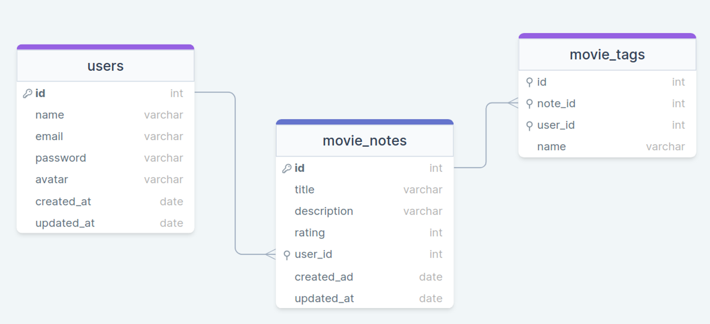

# Node Movies 💻

API developed during my conclusion project - Explorer - Rocketseat  
Create a Node.js application where the user can register a movie, fill in some information (name, description, rating), and create related tags.
# Frameworks and libs

- Express
- Nodemon
- Insomnia

# Diagram

